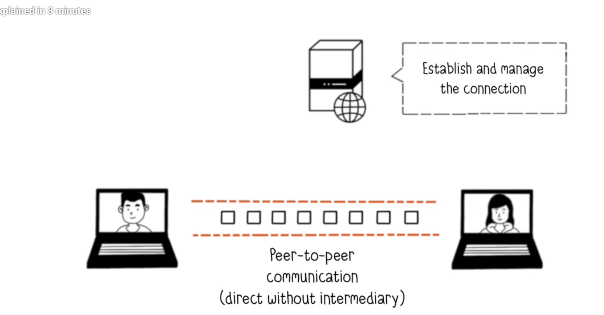
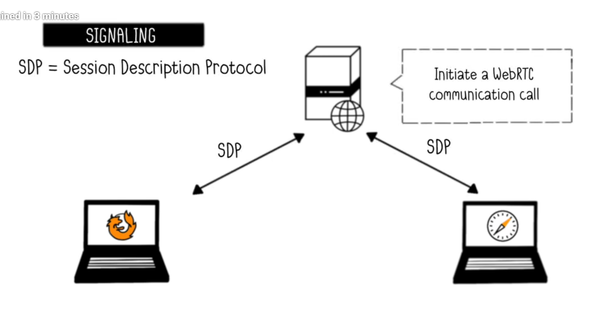

# WebRTC From Hussain nassir

## WebRTC overview - How it works

Here, WebRTC allows to have video calls, transferring data and files without centralized server as you can see in this image. Though centralized server is there but its role is to only establish & manage connections between two clients.

WebRTC allow clients communicate between two users - P2P

When two clients ready to connect each other, they initialy even dont know to whom they will connect.

Now the signaling process begins, which aims to connect two webRTC clients.

## WebRTC Detailed Explanation

- NAT, STUN, TURN, ICE, SDP, Signaling the SDP

1. NAT - Network Address Translation

## Demo

- Without opening VScode, but writing code directly in browser devtools and connecting to browser

## WebRTC pros & cons
